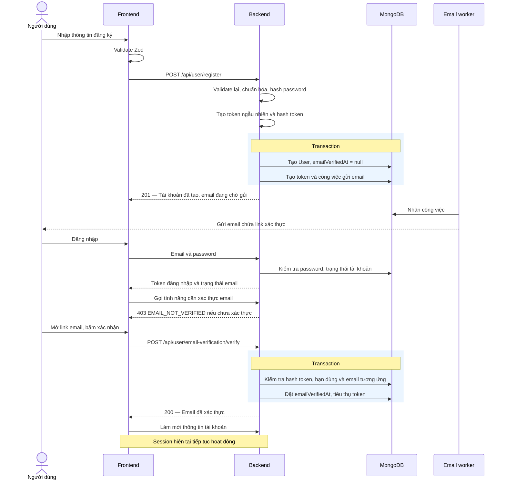

# AudioBay — Đăng ký, đăng nhập và xác thực email

**Trạng thái:** Kế hoạch đã được lưu trong repository.

## 1. Mục tiêu và lựa chọn thiết kế

Tạo `User` ngay khi đăng ký hợp lệ. Người dùng chưa xác thực email vẫn đăng nhập được, nhưng backend giới hạn các tính năng cần email đáng tin cậy.

Dùng `User + EmailVerificationToken`, gửi email qua worker với công việc lưu trong MongoDB. Không dùng `PendingRegistration`.

| Khả năng | Chưa xác thực email | Đã xác thực email |
|---|---|---|
| Đăng nhập, xem hồ sơ | Được | Được |
| Nghe nội dung công khai | Được | Được |
| Lưu yêu thích, playlist riêng | Được nếu tính năng đã có | Được |
| Đánh giá công khai | Chặn | Được |
| Mua, bán, tải nội dung có bản quyền | Chặn | Kiểm tra tiếp quyền nghiệp vụ |
| Gửi lại email xác thực | Được, có giới hạn | Không cần |

Các chức năng thương mại/playlist chưa có trong repo được ghi nhận là chính sách cho phát triển sau; đợt này không xây thêm chúng.

Mỗi email/mobile chỉ thuộc một user ngay từ khi đăng ký. Request đăng ký trùng không được ghi đè password hoặc hồ sơ.

Không tự xóa user chỉ vì chưa xác thực; token và công việc gửi mail được dọn độc lập.

## 2. Mô tả luồng



**Đăng nhập trước khi xác thực:** trả thành công khi mật khẩu đúng và tài khoản không bị khóa; trạng thái email dùng để quyết định quyền từng API.

**Gửi lại email:** người dùng đăng nhập, bấm gửi lại; server đưa công việc vào hàng đợi, không chờ SMTP.

**Quên mật khẩu:** khôi phục qua email, đặt mật khẩu mới và thu hồi các token đăng nhập cũ. Luồng này không tự đánh dấu email đã xác thực; người dùng tiếp tục bước xác thực riêng.

**Link hết hạn:** user vẫn tồn tại, có thể đăng nhập và xin link mới.

## 3. Dữ liệu và các thay đổi backend

### User và validation

Giữ tên trường hiện có để hạn chế thay đổi ngoài phạm vi:

- `firstname`, `lastname`, `email`, `mobile`, `password`.
- Hồ sơ tùy chọn: `addressString`, `dateOfBirth`, `avatar`, `gender`.
- Thêm `emailVerifiedAt: Date | null`, `authVersion: Number` mặc định `0`.
- Giữ `isBlocked` và `role` hiện tại.

`password` trong DB tiếp tục chứa bcrypt hash. Hook Mongoose chịu trách nhiệm hash đúng một lần; sửa hook để không trim mật khẩu. Không đổi sang `passwordHash` trong đợt này.

Tạo module Zod thuần dùng chung FE/BE, tách khỏi Mongoose:

- Bắt buộc năm trường hiện tại; từ chối trường ngoài danh sách.
- Không cho client gửi `role`, `isBlocked`, `emailVerifiedAt`, `authVersion`.
- Email được trim và chuẩn hóa theo chính sách không phân biệt hoa thường.
- Mobile chuẩn hóa E.164; hỗ trợ số Việt Nam nội địa với vùng mặc định VN.
- Password đăng ký mới tối thiểu 15 ký tự, tối đa 72 byte UTF-8, không trim.
- Ngày sinh hợp lệ, không ở tương lai; avatar chỉ nhận URL HTTPS thuộc kho ảnh được cấu hình.
- `gender` giữ kiểu số của model hiện tại; chưa đặt thêm ý nghĩa enum.
- Unique index email/mobile là lớp kiểm tra cuối cùng khi có request đồng thời.

### Token và công việc gửi email

Collection `email_verification_tokens`:

```text
_id
userId
email                   // Email cụ thể đang được xác thực
tokenHash
expiresAt
usedAt?
createdAt

delivery:
  encryptedToken
  status                // queued | sending | sent | failed
  attempts
  nextAttemptAt
  leaseId?
  leaseUntil?
  lastRequestedAt
  requestCount
  lastErrorCode?
```

- Mỗi user có tối đa một bản ghi token hiện hành; unique index `userId` và `tokenHash`.
- Token ngẫu nhiên 32 byte; lưu SHA-256 để kiểm tra.
- Hạn token: 30 phút; TTL index dọn bản ghi hết hạn.
- API luôn kiểm tra `expiresAt`; không phụ thuộc thời điểm TTL thực sự xóa.
- Worker cần token gốc để gửi/retry: lưu bản mã hóa AES-256-GCM, khóa đặt ngoài DB.
- Sau xác thực, đặt `usedAt`, xóa `encryptedToken`; token cũ không dùng lại được.

Tạo user và token trong một transaction. Xác thực cũng dùng transaction, kiểm tra email trong token khớp email hiện tại của user trước khi cập nhật.

### Đăng nhập và phân quyền

- Đăng ký không tự cấp session; FE chuyển sang đăng nhập.
- Giữ luồng access/refresh token hiện có; chưa thêm model `Session` riêng trong đợt này.
- Thêm `authVersion` vào cả hai token. Middleware kiểm tra user tồn tại, không bị khóa và phiên bản khớp DB.
- Access token giảm từ 30 ngày xuống 15 phút; refresh token giữ 7 ngày.
- Đặt lại mật khẩu tăng `authVersion` và xóa refresh token lưu trên user để vô hiệu hóa phiên cũ.
- `requireVerifiedEmail` đọc `emailVerifiedAt` từ user hiện tại; trả `403 EMAIL_NOT_VERIFIED`.
- Áp dụng kiểm tra xác thực email cho đánh giá công khai và thao tác admin ghi dữ liệu. Quyền admin vẫn kiểm tra riêng từ DB.
- Khóa lỗ hổng cập nhật hồ sơ bằng whitelist; không cho cập nhật email/password/quyền qua API hồ sơ chung.
- Bổ sung xác thực cho route upload avatar trước middleware upload.
- Đổi email là tính năng riêng ngoài đợt này; không cho sửa bằng endpoint chung.

## 4. API và worker

| API | Hành vi |
|---|---|
| `POST /api/user/register` | `201` sau khi tạo user và lưu công việc gửi mail |
| `POST /api/user/login` | `200` kể cả chưa xác thực; trả trạng thái email |
| `GET /api/user/current` | Trả hồ sơ an toàn và `emailVerifiedAt` |
| `POST /api/user/email-verification/resend` | Yêu cầu đăng nhập; `202` khi tiếp nhận |
| `POST /api/user/email-verification/verify` | Nhận `{ token }`; không cần đăng nhập; `200` khi hợp lệ |

Giữ `success`, `mes`; bổ sung `code` ổn định cho lỗi. Không trả password hash, verification token hoặc refresh token lưu trong DB qua dữ liệu hồ sơ.

**Các trường hợp lỗi:**

- Payload sai: `400` và lỗi theo trường.
- Email/mobile đã tồn tại: `409 ACCOUNT_EXISTS`; hướng dẫn đăng nhập/khôi phục, không ghi đè dữ liệu.
- Đăng nhập sai: `401` với thông báo chung.
- Token sai, đã dùng hoặc hết hạn: `400 INVALID_OR_EXPIRED_TOKEN`.
- Gửi lại khi đã xác thực: `200 ALREADY_VERIFIED`.
- Vượt giới hạn: `429` kèm `Retry-After`.
- Lỗi DB: không báo đã tạo tài khoản hoặc tiếp nhận gửi mail.

**Worker MongoDB:**

- Process riêng, nhận việc bằng cập nhật nguyên tử với lease 60 giây và `leaseId`.
- Một lượt gửi tối đa 20 giây; đóng kết nối khi quá hạn.
- Mỗi đợt tối đa ba lần: ngay, sau 30 giây, sau 2 phút.
- Chỉ ghi kết quả nếu `leaseId` còn khớp; công việc hết lease được nhận lại.
- Kiểm tra token còn hạn, chưa dùng và user chưa xác thực trước khi gửi.
- Có thể gửi trùng khi crash sau SMTP thành công; email trùng dùng cùng token.

**Gửi lại và hạn mức:**

- Token còn hạn: gửi lại cùng token, không gia hạn.
- Token hết hạn: thay bằng token mới có hạn 30 phút.
- Công việc đang queued/sending: trả `202`, không nhân đôi công việc.
- Cooldown 60 giây; tối đa 3 yêu cầu gửi mail/user/giờ.
- Đăng ký: 10 lần/IP/giờ; verify: 30 lần/IP/15 phút.
- Bộ đếm lưu MongoDB và có TTL để hoạt động nhất quán giữa nhiều instance.

**Frontend:**

- Hiển thị banner xác thực email nhưng cho phép tiếp tục dùng tính năng được phép.
- Email dẫn đến trang xác nhận; GET không thay đổi trạng thái.
- Token nằm trong URL fragment; FE đọc, xóa khỏi thanh địa chỉ và gửi POST khi bấm xác nhận.
- Trang xác nhận không tải analytics bên thứ ba.
- Sau xác thực, gọi lại `/current`; không bắt đăng nhập lại.
- Refresh access token theo luồng hiện có khi hết hạn; chỉ retry request gốc một lần.

## 5. Kiểm thử, chuyển đổi và tiêu chí hoàn thành

**Kiểm thử:**

- Body thiếu/sai, dữ liệu ngoài whitelist và request trùng đồng thời.
- Đăng ký tạo đúng một user; password hash đúng một lần và đăng nhập được.
- User chưa xác thực đăng nhập được nhưng không vượt qua API yêu cầu xác thực.
- Không thể tự đổi quyền, email hoặc trạng thái xác thực qua cập nhật hồ sơ.
- Token sai/hết hạn/đã dùng, email không khớp, hai lần verify đồng thời.
- SMTP chậm, retry, crash, lease hết hạn, gửi lại đồng thời và email trùng.
- Xác thực từ thiết bị khác; GET/link preview không xác thực tài khoản.
- Token hết hạn không xóa user hoặc playlist/dữ liệu tài khoản.
- Đặt lại mật khẩu thu hồi cả access và refresh token cũ.
- Transaction rollback không tạo user thiếu công việc gửi mail.
- API không rò password hash/token; tài khoản bị khóa bị từ chối dù JWT còn hạn.

**Triển khai:**

1. Lưu tài liệu này tại đường dẫn đã chọn khi ra khỏi Plan Mode; kiểm tra Markdown và sơ đồ Mermaid.
2. Dùng MongoDB Atlas hoặc replica set để hỗ trợ transaction; kiểm thử tích hợp cũng chạy trên replica set.
3. Kiểm tra xung đột email/mobile trước khi chuẩn hóa và tạo index; không tự gộp tài khoản.
4. Backfill user cũ với `emailVerifiedAt = null`, `authVersion = 0`; không tự công nhận luồng xác thực cũ là đáng tin cậy.
5. Token đăng nhập cũ không có `authVersion` bị từ chối; thông báo người dùng cần đăng nhập lại.
6. Route xác thực cookie cũ ngừng tạo user, xóa `dataRegister` và hướng dẫn đăng ký lại.
7. Triển khai API, worker và frontend đồng bộ. Admin hiện hữu xác thực email qua luồng mới trước khi tiếp tục thao tác ghi.
8. Theo dõi độ trễ hàng đợi, lỗi SMTP, retry và tỷ lệ xác thực; không log token, password hoặc nội dung email chứa link.

Không tự xóa user chưa xác thực trong phiên bản này. Chưa triển khai Session nhiều thiết bị, đổi email, thanh toán hoặc hệ thống người bán.

**Hoàn thành khi:** người dùng đăng ký và đăng nhập được trước xác thực, chỉ dùng các tính năng được phép, email được gửi bền vững không làm request chờ SMTP, và quyền được cập nhật ngay sau xác thực.
