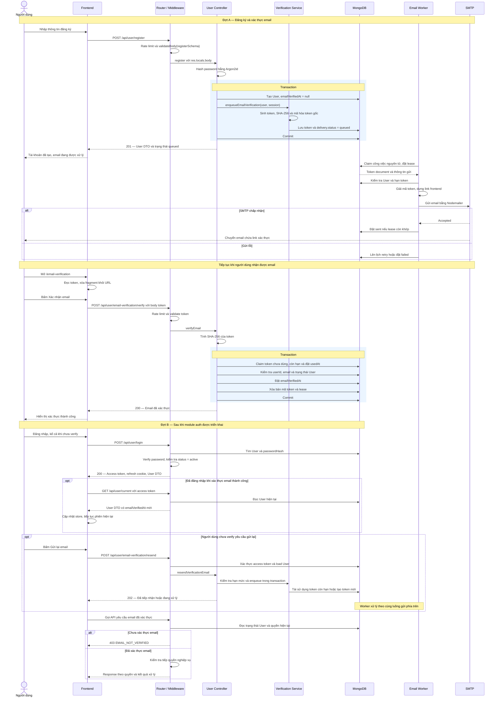

# AudioBay — Kế hoạch triển khai đăng ký và xác thực email

**Trạng thái:** thiết kế để review, chưa triển khai code. Những đoạn code dưới đây là code dự kiến.

## 1. Mục tiêu và lựa chọn thiết kế

> **Điều chỉnh phạm vi:** tạm hoãn rate limit theo yêu cầu. Middleware register/verify, collection bộ đếm và hạn mức/cooldown gửi email đã được gỡ khỏi code đợt A. Các mô tả rate limit/429/bộ đếm bên dưới là thiết kế trước khi hoãn, không còn thuộc phạm vi hiện tại; xem [backlog chi tiết](../backlog/registration-rate-limit.md). Retry/lease của worker và giới hạn hash đồng thời vẫn giữ.

Tạo [User](#user-model) ngay khi đăng ký hợp lệ. Người dùng chưa xác thực email vẫn được đăng nhập khi module đăng nhập được triển khai; backend giới hạn riêng các API yêu cầu email đã xác thực.

Đọc theo luồng: [router](#routes) → [schema](#validation) → [User](#user-model) → [hash password](#password) → [token](#token-model) → [register controller](#register) → [worker](#worker) → [verify](#verify) → [resend](#resend) → [đăng nhập và quyền](#auth). Các liên kết này đưa tới phần code/thiết kế ngay trong tài liệu.

### Đối chiếu repository hiện tại

- Đang có Express 5, TypeScript, Mongoose và Zod 4.
- Router chung: [src/routes/index.ts](../../src/routes/index.ts).
- [validateBody](../../src/middlewares/validate-body.ts) parse schema rồi ghi `res.locals.body`; controller dùng dữ liệu ở đây.
- [Response helper](../../src/utils/response.ts) dùng `success`, `data`, `msg`; không phải `mes`.
- **Chưa có User, router user, bcrypt, JWT, login hoặc email worker.** Các model/module dưới đây đều xây mới, không có luồng auth hiện hữu để giữ nguyên.

### Phạm vi triển khai

1. **Đợt A:** model User, đăng ký, token/công việc trong MongoDB, worker, verify công khai và response. Có thể kiểm thử đăng ký → nhận email → xác thực mà chưa cần login.
2. **Đợt B — chỉ mô tả hợp đồng trong plan này:** đăng nhập/access token/refresh token, middleware auth, `/current`; sau đó nối resend và kiểm tra email vào các API được bảo vệ. Resend dùng access token nên chưa thể sử dụng trước module auth.

Đăng ký và verify không tự cấp phiên. Email/mobile là duy nhất; đăng ký trùng không ghi đè tài khoản. Token hết hạn không làm mất User.

### Sơ đồ tuần tự tổng thể

Sơ đồ thể hiện luồng thành công chính; lỗi token và transaction được mô tả chi tiết ở các bước bên dưới. Phần đợt B mô tả hợp đồng sau khi có module auth; người dùng có thể đăng nhập trước hoặc sau khi xác thực email.



<a id="routes"></a>

## 2. Bước 1 — Mount router user

Sửa `src/routes/index.ts`, thêm import và mount trước `app.use("/api", apiRouter)`:

```ts
import userRouter from "@/routes/user";

// Bên trong initRoutes:
apiRouter.use("/user", userRouter);
```

Tạo `src/routes/user.ts`. Skeleton thể hiện thứ tự xử lý, cần bổ sung import tương ứng khi các module được viết:

```ts
const router = Router();
router.post("/register", registerRateLimit, validateBody(registerSchema), register);
router.post(
  "/email-verification/verify",
  verifyRateLimit,
  validateBody(verifyEmailSchema),
  verifyEmail,
);

// Chỉ gắn ở đợt B, sau khi có requireAuth:
router.get("/current", requireAuth, getCurrentUser);
router.post("/email-verification/resend", requireAuth, resendVerificationEmail);
export default router;
```

| Endpoint                                   | Đầu vào                                         | Kết quả                                           |
| ------------------------------------------ | ----------------------------------------------- | ------------------------------------------------- |
| `POST /api/user/register`                  | JSON registerSchema                             | 201: User và công việc đã lưu                     |
| `POST /api/user/email-verification/verify` | JSON `{ token }`, không cần login               | 200: email đã xác thực                            |
| `POST /api/user/email-verification/resend` | Access token, không nhận userId/email từ client | 202: tiếp nhận hoặc đang xử lý; 200 nếu đã verify |
| `GET /api/user/current`                    | Access token                                    | 200: hồ sơ mới nhất từ DB                         |
| `POST /api/user/login`                     | Email/password                                  | Hợp đồng đợt B ở mục 11                           |

<a id="validation"></a>

## 3. Bước 2 — Zod schema và res.locals.body

Tạo `src/validators/user.ts`. Năm trường bắt buộc: firstname, lastname, email, mobile, password; ngày sinh tùy chọn.

```ts
import { z } from "zod";
import { parsePhoneNumberFromString } from "libphonenumber-js";

const mobileSchema = z
  .string()
  .trim()
  .max(32)
  .transform((value, ctx) => {
    const phone = parsePhoneNumberFromString(value, "VN");
    if (!phone?.isValid()) {
      ctx.addIssue({ code: "custom", message: "Số điện thoại không hợp lệ" });
      return z.NEVER;
    }
    return phone.number; // E.164
  });

export const registerSchema = z.strictObject({
  firstname: z.string().trim().min(1).max(100),
  lastname: z.string().trim().min(1).max(100),
  email: z.string().trim().toLowerCase().pipe(z.email()).max(254),
  mobile: mobileSchema,
  password: z.string().min(15).max(128), // Không trim
  dateOfBirth: z.iso
    .date()
    .refine(isNotFutureDate, {
      message: "Ngày sinh không được ở tương lai",
    })
    .optional(),
});

export const verifyEmailSchema = z.strictObject({
  token: z.string().regex(/^[A-Za-z0-9_-]{43}$/),
});
export type RegisterInput = z.output<typeof registerSchema>;
```

`isNotFutureDate` là helper cần viết trong file này: so sánh ngày hợp lệ `YYYY-MM-DD` với ngày hôm nay theo `Asia/Bangkok`. Không parse theo cách tự chuyển ngày không tồn tại sang tháng sau.

`z.strictObject` từ chối field ngoài danh sách, bao gồm role, status, passwordHash, emailVerifiedAt. Controller đọc `res.locals.body`, không dùng trực tiếp req.body để tạo User.

Các schema trên chạy đồng bộ nên dùng được middleware hiện tại. Nếu thêm refinement bất đồng bộ, phải đổi `schema.parse` thành `schema.parseAsync`; chỉ `await schema.parse(...)` không hỗ trợ refinement async.

**Ngày sinh/tuổi:** FE dùng date picker và gửi `dateOfBirth: "1998-05-20"`. Lưu ngày sinh, không lưu age vì tuổi sẽ lỗi thời. Tuổi được tính theo năm hiện tại và đã qua sinh nhật hay chưa. DB lưu chuỗi ngày thuần để tránh lệch ngày do timezone. Nếu tuổi quyết định quyền nghiệp vụ, BE tự tính lại thay vì tin tuổi FE gửi.

<a id="user-model"></a>

## 4. Bước 3 — Model User cụ thể

Tạo `src/constants/user.ts` trước model để schema và middleware dùng chung:

```ts
export const USER_ROLE = { USER: "user", ADMIN: "admin" } as const;
export type UserRole = (typeof USER_ROLE)[keyof typeof USER_ROLE];
export const USER_ROLE_VALUES = Object.values(USER_ROLE);

export const USER_STATUS = { ACTIVE: "active", SUSPENDED: "suspended" } as const;
export type UserStatus = (typeof USER_STATUS)[keyof typeof USER_STATUS];
export const USER_STATUS_VALUES = Object.values(USER_STATUS);
```

Tạo `src/models/user.ts`, export từ `src/models/index.ts`:

```ts
import mongoose from "mongoose";
import { USER_ROLE, USER_ROLE_VALUES, USER_STATUS, USER_STATUS_VALUES } from "@/constants/user";

const userSchema = new mongoose.Schema(
  {
    firstname: { type: String, required: true, trim: true },
    lastname: { type: String, required: true, trim: true },
    email: { type: String, required: true, trim: true, lowercase: true },
    mobile: { type: String, required: true },
    passwordHash: { type: String, required: true, select: false },
    dateOfBirth: { type: String, default: null }, // YYYY-MM-DD, validate qua Zod
    emailVerifiedAt: { type: Date, default: null },
    status: { type: String, enum: USER_STATUS_VALUES, default: USER_STATUS.ACTIVE, required: true },
    role: { type: String, enum: USER_ROLE_VALUES, default: USER_ROLE.USER, required: true },
  },
  { timestamps: true },
);

userSchema.index({ email: 1 }, { unique: true });
userSchema.index({ mobile: 1 }, { unique: true });
export default mongoose.model("User", userSchema);
```

| Field                    | Ý nghĩa                                                          |
| ------------------------ | ---------------------------------------------------------------- |
| `_id`                    | MongoDB tự sinh; token liên kết tới ID này                       |
| `passwordHash`           | Chứa Argon2id hash; request vẫn nhận field password              |
| `emailVerifiedAt`        | null khi chưa xác thực; Date khi đã xác thực; thống nhất tên này |
| `status`                 | Enum active/suspended; chỉ quản trị được thay đổi                |
| `role`                   | Enum chuỗi user/admin; tài khoản tự đăng ký luôn là user         |
| `createdAt`, `updatedAt` | Tự sinh bởi timestamps                                           |

**Trạng thái tài khoản:** active cho phép hoạt động, suspended nghĩa là quản trị đình chỉ. User mới có status active dù emailVerifiedAt vẫn null; trạng thái tài khoản độc lập với xác thực email. Chỉ cho đăng nhập/sử dụng API có auth khi status === USER_STATUS.ACTIVE; suspended trả 403 ACCOUNT_SUSPENDED. Chưa thêm deactivated cho tới khi có luồng tự vô hiệu hóa/khôi phục. Không giữ cờ Boolean trùng ý nghĩa với status.

**Vai trò:** enum chuỗi dùng constant/type chung để tránh định nghĩa lệch. TypeScript type kiểm tra lúc viết code; Mongoose enum kiểm tra giá trị dữ liệu; middleware kiểm tra quyền thực hiện thao tác. Enum không ngăn nâng quyền nếu controller cho client ghi role. Đăng ký tự gán USER_ROLE.USER; cập nhật hồ sơ không nhận role/status; thay đổi hai trường này cần thao tác quản trị riêng. Chưa cần collection roles/permissions khi chưa có nhu cầu quản trị quyền động.

Trường avatar/address/gender sẽ định nghĩa khi làm hồ sơ; không thêm trường chưa dùng vào đăng ký.

DTO trả ra dựng bằng whitelist: `{ id, firstname, lastname, email, mobile, dateOfBirth, emailVerifiedAt, role }`. Không trả thẳng document vừa create: `select: false` không tự loại passwordHash khỏi kết quả tạo mới. API sửa hồ sơ sau này cũng cần whitelist riêng, không cho sửa email/password/quyền/trạng thái qua payload hồ sơ chung.

<a id="password"></a>

## 5. Bước 4 — Hash password bằng Argon2id

Thêm package `argon2`, tạo `src/services/password.ts`:

```ts
import * as argon2 from "argon2";

export const hashPassword = (password: string) => argon2.hash(password, { type: argon2.argon2id });

export const verifyPassword = (passwordHash: string, password: string) =>
  argon2.verify(passwordHash, password);
```

Thư viện tự sinh salt, chuỗi hash chứa tham số cần cho verify. Dùng default của thư viện rồi đo thời gian/bộ nhớ trên môi trường chạy trước khi chỉnh cost. Xem [node-argon2](https://github.com/ranisalt/node-argon2).

Controller hash đúng một lần **trước transaction**, lưu passwordHash. Không thêm hook Mongoose hash lần nữa. Không trim/log/lưu password gốc. Chính sách đăng ký 15–128 ký tự, không dùng giới hạn 72 byte của bcrypt. Cần giới hạn request hash đồng thời để bảo vệ CPU/bộ nhớ. Repo chưa có bcrypt hoặc dữ liệu User để cần migrate thuật toán.

<a id="token-model"></a>

## 6. Bước 5 — Collection token và công việc gửi email

### Có thực sự cần collection riêng không?

Không bắt buộc: có thể nhúng token vào User. Trong thiết kế này chọn collection `email_verification_tokens` vì dữ liệu có vòng đời ngắn, cần worker query nhận việc và TTL dọn độc lập. Không đặt TTL trên User vì sẽ xóa cả document tài khoản.

Một document gồm **bằng chứng xác thực email** và **công việc gửi email chờ worker**. Nó không chỉ theo dõi việc gửi mail. MongoDB là hàng đợi bền vững ở phiên bản này, chưa cần Redis/BullMQ.

Tạo `src/models/email-verification-token.ts`. Hình dạng dữ liệu để chuyển thành Mongoose schema:

```ts
type VerificationTokenRecord = {
  _id: mongoose.Types.ObjectId;
  userId: mongoose.Types.ObjectId;
  email: string;
  tokenHash: string;
  createdAt: Date;
  expiresAt: Date;
  usedAt: Date | null;
  delivery: {
    encryptedToken?: { ciphertext: string; iv: string; tag: string; keyId: string };
    status: "queued" | "sending" | "sent" | "failed";
    attempts: number;
    nextAttemptAt: Date;
    leaseId?: string;
    leaseUntil?: Date;
    lastErrorCode?: string;
  };
};
```

| Field                              | Mục đích                                                                           |
| ---------------------------------- | ---------------------------------------------------------------------------------- |
| `_id`                              | Định danh document/công việc cho worker cập nhật                                   |
| `userId`                           | Liên kết user; một user tối đa một document hiện hành                              |
| `email`                            | Email cụ thể đang xác thực; phải khớp email hiện tại của User                      |
| `tokenHash`                        | SHA-256 của token gốc; tra cứu token khi verify, không giải ngược được             |
| `createdAt`                        | Thời điểm tạo token; thay đổi khi sinh token mới                                   |
| `expiresAt`                        | Hết hạn sau 30 phút; API/worker tự kiểm tra thời gian                              |
| `usedAt`                           | null: chưa dùng; Date: đã dùng và dùng lúc nào                                     |
| `encryptedToken`                   | Worker cần token gốc để tạo link/retry; lưu bản mã AES-256-GCM                     |
| `ciphertext`, `iv`, `tag`, `keyId` | Bản mã, nonce, tag toàn vẹn và ID khóa giải mã                                     |
| `status`                           | queued: chờ; sending: đang giữ việc; sent: SMTP chấp nhận; failed: không còn retry |
| `attempts`                         | Số lần nhận gửi của đợt hiện tại, tính cả lần đầu; tối đa 3                        |
| `nextAttemptAt`                    | Worker chỉ được nhận khi đến thời điểm này                                         |
| `leaseId`                          | Mã lần giữ việc; chặn worker cũ ghi đè worker mới                                  |
| `leaseUntil`                       | Hạn giữ việc; worker chết thì có thể nhận lại sau hạn                              |
| `lastErrorCode`                    | Mã lỗi đã lọc như SMTP_TIMEOUT, không lưu credentials/link/raw error               |

Index: unique userId, unique tokenHash; TTL expiresAt với `expireAfterSeconds: 0`; index nhận việc theo status/nextAttemptAt và status/leaseUntil. Schema dùng `Schema.Types.ObjectId` cho userId. Đặt tokenHash/encryptedToken `select: false`, worker/service select rõ khi cần.

**Sau khi dùng:** ghi usedAt, xóa encryptedToken và lease; giữ document đến khi TTL dọn, không xóa ngay. User luôn tồn tại. Token sai/đã dùng/đã bị TTL xóa đều có thể trả lỗi chung. [TTL có thể xóa trễ](https://www.mongodb.com/docs/manual/core/index-ttl/), vì vậy phải kiểm tra expiresAt trong query, không chỉ kiểm tra document còn tồn tại.

**Bỏ lastRequestedAt/requestCount trong delivery của plan cũ.** Token bị thay hoặc TTL xóa sẽ làm mất bộ đếm. Hạn mức nằm trong collection phụ `rate_limit_buckets`: key unique, count, windowEndsAt, expiresAt; cooldown lưu nextAllowedAt theo user. Cập nhật có điều kiện nguyên tử, kiểm tra thời gian trong query; TTL chỉ dọn. Đây là collection rate limit, không phải token thứ hai.

### Service sinh token dùng chung

Tạo `src/services/token-crypto.ts` và `src/services/email-verification.ts`:

```ts
import { createHash, randomBytes } from "node:crypto";

const rawToken = randomBytes(32).toString("base64url"); // 43 ký tự
const tokenHash = createHash("sha256").update(rawToken).digest("hex");
const expiresAt = new Date(Date.now() + 30 * 60 * 1000);
```

Password do người dùng chọn nên dùng Argon2id; token có 256 bit ngẫu nhiên nên dùng SHA-256 để tra cứu. Mã hóa rawToken bằng AES-256-GCM, khóa 32 byte ngoài DB, IV ngẫu nhiên 12 byte mới mỗi lần; lưu IV/tag/keyId cùng bản mã. Cấu hình khóa thiếu/sai phải fail startup. Không log/response rawToken.

Service chung dự kiến:

```text
enqueueEmailVerification({ user, session, now })
  → { status: "queued" | "sending", expiresAt }
```

Register và resend gọi cùng service trong transaction: chưa có/hết hạn thì tạo mới; còn hạn thì tái sử dụng; queued hoặc sending còn lease thì không tạo thêm việc.

<a id="register"></a>

## 7. Bước 6 — Controller register và response

Tạo `src/controllers/user.ts`. Luồng register:

1. Rate limit → validateBody(registerSchema) → dữ liệu chuẩn hóa ở res.locals.body.
2. Controller lấy field hợp lệ, hash password trước transaction.
3. Mở `mongoose.connection.transaction(async session => ...)`.
4. Tạo User với payload whitelist, passwordHash; server đặt emailVerifiedAt null, status USER_STATUS.ACTIVE, role USER_ROLE.USER.
5. Gọi enqueueEmailVerification: sinh token, lưu hash/bản mã và delivery queued. Mọi DB operation truyền cùng session.
6. Commit: User và công việc cùng tồn tại; lỗi thì rollback cả hai. Không gửi SMTP trong transaction vì callback có thể retry.
7. Sau commit, gọi `sendCreated(res, { user: toPublicUser(user), emailVerification: { status: "queued", expiresAt } })`.

Controller dùng type `ValidatedBodyHandler<RegisterInput>` có sẵn từ middleware. Response dự kiến:

```json
{
  "success": true,
  "data": {
    "user": {
      "id": "<userId>",
      "firstname": "An",
      "lastname": "Nguyen",
      "email": "an@example.com",
      "mobile": "+84901234567",
      "dateOfBirth": "1998-05-20",
      "emailVerifiedAt": null,
      "role": "user"
    },
    "emailVerification": {
      "status": "queued",
      "expiresAt": "2026-09-23T10:30:00.000Z"
    }
  },
  "msg": "Created successfully"
}
```

201 xác nhận tài khoản/công việc đã lưu, không hứa email vào inbox. queued là trạng thái lúc commit; worker có thể đã nhận việc khi FE nhận response. Không trả response lần hai sau khi email gửi xong. FE hiện thông báo đã tạo tài khoản/email đang xử lý; chuyển đăng nhập khi đợt B sẵn sàng.

Unique index là lớp chặn trùng cuối cùng, kể cả request đồng thời. Duplicate email/mobile trả 409 ACCOUNT_EXISTS; DB/commit lỗi trả 5xx. Nếu response bị mất sau commit, retry có thể nhận 409; người dùng đăng nhập và resend ở đợt B.

<a id="worker"></a>

## 8. Bước 7 — Worker dùng gì, nhận gì và xử lý thế nào?

Thêm `nodemailer` và typings phù hợp. Tạo `src/services/mailer.ts`, `src/workers/email-verification.ts`. Worker là process Node riêng, kết nối cùng MongoDB; script dự kiến `worker:email: tsx src/workers/email-verification.ts`. Vận hành/giám sát độc lập với HTTP server.

Mailer nhận dữ liệu từ công việc đã claim:

```ts
type VerificationMail = { to: string; firstname: string; verificationUrl: string };
// sendVerificationEmail(input: VerificationMail): Promise<void>

const transporter = nodemailer.createTransport({
  host: env.SMTP_HOST,
  port: env.SMTP_PORT,
  secure: env.SMTP_PORT === 465,
  requireTLS: env.SMTP_PORT !== 465,
  auth: { user: env.SMTP_USER, pass: env.SMTP_PASSWORD },
  connectionTimeout: 10_000,
  greetingTimeout: 10_000,
  socketTimeout: 20_000,
});
```

`env` cần parse/validate lúc startup trong `src/config/email.ts`. Thêm SMTP_FROM, FRONTEND_URL và khóa/keyId mã hóa token; dùng cấu hình MongoDB hiện tại. FRONTEND_URL lấy từ cấu hình tin cậy, không từ Host header. Template có text/HTML; escape firstname khi chèn HTML.

Worker nhận **document trong DB**, không nhận callback hay password từ controller:

1. Poll, nghỉ khoảng 1 giây khi không có việc. `findOneAndUpdate` nguyên tử claim một token chưa dùng, còn hạn, attempts < 3, queued đã đến nextAttemptAt hoặc sending hết lease.
2. Đặt sending, leaseId ngẫu nhiên, leaseUntil sau 60 giây, tăng attempts ngay khi claim để crash vẫn được tính.
3. Load User; kiểm tra email khớp, chưa verify, status === USER_STATUS.ACTIVE. Không hợp lệ thì đóng công việc và bỏ bản mã; job hết hạn bị bỏ qua để TTL dọn.
4. Giải mã token, dựng `${FRONTEND_URL}/email-verification#token=<rawToken>`, gọi mailer với email từ document và tên từ user.
5. SMTP chấp nhận đúng người nhận: đặt sent, bỏ lease/error. Giữ bản mã đến lúc verify/hết hạn để resend cùng link.
6. Lỗi tạm: queued và nextAttemptAt; tối đa ba lần: lần đầu ngay, retry sau 30 giây rồi sau 2 phút. Lỗi vĩnh viễn/hết lượt: failed. Job sending hết lease và attempts đã bằng 3 phải được dọn thành failed.
7. Ghi kết quả với điều kiện `_id`, tokenHash, leaseId, usedAt null còn khớp; worker cũ không được ghi đè token mới hoặc phục hồi bản mã đã tiêu thụ.

Theo [Nodemailer SMTP](https://nodemailer.com/smtp), socketTimeout là thời gian không hoạt động, không phải tổng thời gian gửi. Cần deadline tổng 20 giây và đóng transport/kết nối của lần gửi khi hết hạn; không chỉ Promise.race mà để SMTP tiếp tục. Bản đầu xử lý tuần tự, kiểm thử hủy kết nối trước khi tăng concurrency.

sent chỉ nghĩa SMTP chấp nhận, không chứng minh tới inbox/đã đọc. Crash sau SMTP thành công trước ghi DB có thể gửi trùng; retry dùng cùng token. Verify trong khi SMTP chạy vẫn có thể có email thừa, nhưng worker không được ghi đè usedAt.

<a id="verify"></a>

## 9. Bước 8 — Mở link, verify token, cập nhật user

Chọn **fragment trên URL frontend, JSON body khi gọi backend**, không dùng query/path API cho token:

```text
Email → GET https://<frontend>/email-verification#token=...
FE → người dùng bấm “Xác nhận email”
FE → POST /api/user/email-verification/verify
     { "token": "..." }
```

FE đọc fragment vào bộ nhớ, xóa khỏi thanh địa chỉ bằng history.replaceState. Trang không tải analytics bên thứ ba. GET chỉ mở trang để trình quét link không tự verify. Reload sau khi xóa fragment thì mở lại link email. Backend không yêu cầu login, cho phép xác thực trên thiết bị khác.

Controller verifyEmail:

1. Đọc token từ res.locals.body; tính SHA-256 bằng cùng helper.
2. Trong transaction, claim token qua `findOneAndUpdate({ tokenHash, usedAt: null, expiresAt: { $gt: now } }, ...)`, đặt usedAt now. Không tìm thấy thì lỗi chung.
3. Cập nhật User có ID token.userId, email khớp token.email, emailVerifiedAt null và status bằng USER_STATUS.ACTIVE; đặt emailVerifiedAt now. Không cập nhật được thì abort transaction, không tiêu thụ token một phần.
4. Xóa delivery.encryptedToken, leaseId, leaseUntil trong cùng transaction. usedAt quyết định đã tiêu thụ, delivery.status chỉ mô tả SMTP.
5. Commit; trả `sendSuccess(res, { emailVerifiedAt: now }, { msg: "Email đã được xác thực" })`, HTTP 200. Không trả JWT/hồ sơ người nhận chỉ vì client cầm link.

Hai verify đồng thời chỉ một lần commit; lần còn lại trả `400 INVALID_OR_EXPIRED_TOKEN`. Token sai/hết hạn/đã dùng/email lệch không đổi User. Không yêu cầu delivery.sent để token hợp lệ.

**Làm mới thông tin FE:** nếu đang đăng nhập, gọi `/api/user/current`, cập nhật store. Quyền đọc từ User hiện tại trong DB nên có hiệu lực ngay; không cần tạo session mới. Access hết hạn thì dùng refresh của đợt B rồi gọi lại current một lần. Thiết bị chưa login chỉ hiện thành công và cho đăng nhập. Nếu đang login tài khoản khác chủ link, current trả tài khoản đang login, không chuyển tài khoản.

<a id="resend"></a>

## 10. Bước 9 — Route resend tái sử dụng service

Kết nối sau khi đợt B có auth:

```text
POST /api/user/email-verification/resend
Authorization: Bearer <accessToken>
→ requireAuth → res.locals.user từ DB
→ resendVerificationEmail → enqueueEmailVerification
```

Đúng: lấy ID từ access token đã kiểm tra chữ ký/hạn, rồi load User. Không nhận userId/email từ client hoặc tin email cũ trong JWT.

1. Đã verify: 200 ALREADY_VERIFIED, không gửi.
2. Trong transaction, token còn hạn và job queued/sending lease còn hiệu lực: 202, không tạo thêm việc.
3. Nếu cần đợt gửi mới, chiếm cooldown/hạn mức bằng update nguyên tử trong cùng transaction. Token còn hạn: giữ hash/bản mã/expiresAt, đặt queued và attempts 0; hết hạn/chưa có: sinh token mới 30 phút.
4. Hai resend đồng thời chỉ tạo một đợt; unique userId và transaction xử lý xung đột. Job sending hết lease do worker phục hồi, không ghi đè lease còn hiệu lực.
5. Commit rồi trả 202 với `{ success: true, data: { emailVerification: { status, expiresAt } }, msg: "Đã tiếp nhận yêu cầu gửi email" }`; status queued hoặc sending theo công việc hiện tại.

Hạn mức đề xuất: cooldown 60 giây, tối đa 3 đợt gửi/user/cửa sổ một giờ, tính cả lúc đăng ký; retry tự động của worker không tính là yêu cầu mới. Register 10 request/IP/giờ, verify 30 request/IP/15 phút; thêm hạn mức resend/IP kể cả khi job đang chờ. 429 kèm Retry-After. Bộ đếm MongoDB không reset khi token bị thay/xóa; cấu hình trusted proxy đúng khi lấy IP.

<a id="auth"></a>

## 11. Đăng nhập và phân quyền — hợp đồng đợt B

Chưa triển khai login trong đợt A. Đợt B cần thiết kế/triển khai chữ ký JWT, lưu refresh token, rotation và logout đầy đủ.

1. POST /login validate email/password, chuẩn hóa email và giữ nguyên password. Schema login không áp chính sách đăng ký mới lên mật khẩu hiện hữu.
2. Query User `.select("+passwordHash")`, gọi verifyPassword; email không tồn tại/sai password đều trả 401 INVALID_CREDENTIALS.
3. Password đúng nhưng status là USER_STATUS.SUSPENDED: 403 ACCOUNT_SUSPENDED. Chỉ cho đăng nhập khi status === USER_STATUS.ACTIVE; trạng thái không được hỗ trợ phải bị từ chối.
4. Còn lại: 200 kể cả emailVerifiedAt null. JSON trả accessToken và user DTO; refresh token cấp qua cookie HttpOnly, Secure, SameSite/path và CSRF phù hợp deployment. FE nhận hai cơ chế, JS không đọc refresh cookie.
5. Access dự kiến 15 phút, refresh 7 ngày, chứa sub để định danh user. Middleware kiểm tra chữ ký, thuật toán cho phép, issuer/audience, hạn, loại token; load User và kiểm tra status === USER_STATUS.ACTIVE. Thiếu/sai auth: 401; suspended: 403 ACCOUNT_SUSPENDED. Không chỉ loại trừ suspended vì sau này có thể thêm trạng thái khác.
6. GET /current trả hồ sơ mới nhất. requireVerifiedEmail chạy sau requireAuth: chưa verify thì 403 EMAIL_NOT_VERIFIED; verify rồi vẫn cần role/quyền nghiệp vụ.

```ts
const requireVerifiedEmail: RequestHandler = (_req, res, next) => {
  if (!res.locals.user.emailVerifiedAt) {
    return res.status(403).json({
      success: false,
      code: "EMAIL_NOT_VERIFIED",
      msg: "Bạn cần xác thực email để dùng chức năng này",
    });
  }
  next();
};
```

Ví dụ kiểm tra quyền sau middleware auth đã load User từ DB:

```ts
if (user.role !== USER_ROLE.ADMIN) {
  return res.status(403).json({
    success: false,
    code: "FORBIDDEN",
    msg: "Bạn không có quyền thực hiện thao tác này",
  });
}
```

Khi viết thật, thêm type cho res.locals.user và kết hợp với locals.body. Không gắn guard này vào login/current/resend. Các route ghi danh mục hiện có sẽ cần auth + verified + admin ở đợt tích hợp quyền; verify email không tự cấp quyền sửa danh mục.

Kho refresh token, rotation và thu hồi phiên cần thiết kế riêng ở đợt B. Không làm reset password trong đợt đăng ký.

## 12. Danh sách file và thứ tự triển khai

| Thứ tự | File dự kiến                                                                   | Công việc                                                               |
| ------ | ------------------------------------------------------------------------------ | ----------------------------------------------------------------------- |
| 1      | src/routes/index.ts, src/routes/user.ts                                        | Mount và skeleton; chỉ bật route sau khi có dependency                  |
| 2      | src/validators/user.ts                                                         | Register/verify schema, ngày sinh, E.164                                |
| 3      | src/constants/user.ts, src/models/user.ts, src/models/index.ts                 | User/index/export                                                       |
| 4      | src/services/password.ts                                                       | Hash/verify Argon2id                                                    |
| 5      | src/models/email-verification-token.ts                                         | Token/delivery/index/TTL                                                |
| 6      | src/services/token-crypto.ts, src/services/email-verification.ts               | Hash/mã hóa token và enqueue chung                                      |
| 7      | src/models/rate-limit-bucket.ts, src/middlewares/rate-limit.ts                 | Bộ đếm/cooldown nguyên tử                                               |
| 8      | src/controllers/user.ts, src/utils/user-dto.ts                                 | Register/verify transaction và DTO                                      |
| 9      | src/middlewares/error-handler.ts                                               | Mã lỗi ổn định, lỗi nghiệp vụ, JSON 500 không lộ stack/secret           |
| 10     | src/config/email.ts, src/services/mailer.ts, src/workers/email-verification.ts | Env/SMTP/template/claim/retry                                           |
| 11     | package.json, lockfile, file env mẫu                                           | argon2, nodemailer, libphonenumber-js, typings cần thiết, script worker |
| 12     | tests/*.test.mjs                                                               | Unit/integration theo test runner hiện tại                              |
| Đợt B  | Auth controller/middleware/router; current/resend/guard                        | Nối sau kế hoạch auth                                                   |

Các đường dẫn mới là dự kiến, chưa có file để click. FE nằm ngoài repo backend này; chỉ tách schema thành package chia sẻ khi có workspace FE phù hợp, không giả định đã có package chung.

## 13. Lỗi, kiểm thử và tiêu chí hoàn thành

| Trường hợp                | HTTP/code                                                                 |
| ------------------------- | ------------------------------------------------------------------------- |
| Payload sai               | 400 VALIDATION_ERROR; giữ msg, bổ sung errors theo field                  |
| Email/mobile trùng        | 409 ACCOUNT_EXISTS, không trả raw DB error                                |
| Token sai/hết hạn/đã dùng | 400 INVALID_OR_EXPIRED_TOKEN                                              |
| Vượt hạn mức              | 429 RATE_LIMITED + Retry-After                                            |
| DB/lỗi nội bộ             | 500 INTERNAL_ERROR; lỗi tạm phân loại được có thể 503 SERVICE_UNAVAILABLE |

SMTP lỗi sau commit không đổi kết quả đăng ký: User vẫn tồn tại, worker retry. Đợt A chưa có resend cho người dùng; cần đợt B trước khi bàn giao trải nghiệm đăng ký đầy đủ cho sản phẩm.

**Test đợt A:** model mặc định active/user, enum từ chối role/status không hợp lệ, đăng ký từ chối client gửi role/status; payload/unknown fields; email/mobile chuẩn hóa; ngày sai/tương lai; password giữ khoảng trắng; Argon2 verify; DTO không lộ hash; đăng ký trùng đồng thời; transaction rollback; verify sai/hết hạn/đã dùng/email lệch/user suspended/đồng thời; SMTP chậm/retry/crash/lease/hết lượt; worker cũ không ghi đè; TTL không xóa user; rate limit không reset theo token; link preview không verify; xác thực từ thiết bị khác không tạo phiên.

**Test đợt B:** login trước verify, status suspended bị từ chối, refresh/rotation, resend đồng thời/cooldown, current cập nhật ngay sau verify, API chưa verify trả 403 và admin vẫn cần role đúng.

MongoDB phải chạy replica set hoặc sharded cluster hỗ trợ transaction; development/test dùng replica set, không âm thầm bỏ transaction khi standalone. Xem [MongoDB transactions](https://www.mongodb.com/docs/manual/core/transactions/). Tạo index trước khi nhận traffic. Nếu môi trường triển khai có dữ liệu User ngoài repo thì audit riêng, không tự giả định cần backfill/migrate dữ liệu cũ.

Khi triển khai code chạy npm run typecheck, npm run lint, npm test và format các file thay đổi; integration test dùng DB riêng và SMTP giả. Theo dõi queued lâu, failed/retry và độ trễ; không log password/token/refresh cookie/link email.

**Đợt A hoàn thành:** đăng ký lưu User + job nguyên tử, worker gửi/retry được, verify đúng một lần, response/lỗi/test đạt yêu cầu. **Luồng sản phẩm đầy đủ hoàn thành sau đợt B:** login trước verify, resend có auth, cập nhật FE và phân quyền từng API.
