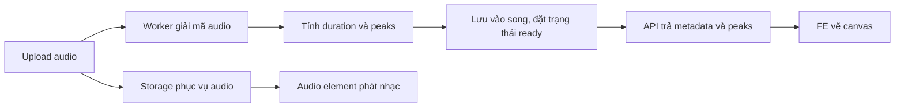

# Waveform của bài hát

Mẫu này dành cho waveform hiển thị toàn bộ bài hát, kiểu các cột biên độ.
FE nhận dữ liệu preview trong API bài hát và vẽ ngay, còn audio được tải riêng
để phát. Không cần gọi `decodeAudioData()` trên FE để dựng hình này.

## Dữ liệu trong schema

```json
{
  "streamUrl": "https://media.example.com/song.mp3",
  "durationMs": 241520,
  "waveformStatus": "ready",
  "waveformPeaks": [0.08, 0.24, 0.71, 0.93, 0.42, 0.16]
}
```

Mảng trên được rút ngắn để minh họa. Đề xuất tạo 1024 điểm cho preview;
schema giới hạn tối đa 2048 điểm để payload không tăng theo độ dài file.
Mỗi điểm là biên độ tuyệt đối lớn nhất trên mọi channel trong một khoảng
thời gian. Các khoảng có độ dài xấp xỉ bằng nhau và phủ hết bài hát.
Giá trị nằm trong `0..1`; đây là dữ liệu để vẽ, không thể dùng để phát nhạc.

`waveformPeaks` và `durationMs` chưa có giá trị khi chưa phân tích audio.
Mảng toàn số 0 là một waveform hợp lệ cho audio im lặng.

## Luồng xử lý đề xuất



Đặt `waveformStatus` lần lượt là `pending`, `processing`, `ready`, hoặc
`failed` khi xử lý lỗi. Khi còn chờ, FE hiển thị placeholder; có thể lấy lại
metadata hoặc nhận thông báo từ server khi hoàn tất.

Các trường schema không tự tạo ra waveform. Repository hiện chưa có upload
handler, queue hay worker giải mã audio; phần dưới là mẫu để nối vào luồng đó.

Ví dụ hàm tạo preview sau khi worker đã giải mã audio thành PCM dạng
`Float32Array[]`, mỗi phần tử là một channel có cùng số lượng sample:

```ts
function createWaveformPeaks(channels: Float32Array[]): number[] {
  const sampleCount = channels[0]?.length ?? 0;
  if (!sampleCount || channels.some((channel) => channel.length !== sampleCount)) {
    throw new Error("Audio channels must be nonempty and have equal lengths.");
  }

  const pointCount = Math.min(1024, sampleCount);

  return Array.from({ length: pointCount }, (_, index) => {
    const start = Math.floor((index * sampleCount) / pointCount);
    const end = Math.floor(((index + 1) * sampleCount) / pointCount);
    let peak = 0;

    for (const channel of channels) {
      for (let sample = start; sample < end; sample++) {
        const amplitude = Math.abs(channel[sample]);
        if (!Number.isFinite(amplitude)) throw new Error("Invalid PCM sample.");
        peak = Math.max(peak, amplitude);
      }
    }

    return Math.round(Math.min(1, peak) * 1000) / 1000;
  });
}
```

Ví dụ lưu kết quả trong worker; `channels`, `sampleRate` đến từ decoder,
`songId` đến từ job xử lý upload:

```ts
import { Song } from "@/models/index";

const waveformPeaks = createWaveformPeaks(channels);
const durationMs = Math.round((channels[0].length / sampleRate) * 1000);

await Song.updateOne(
  { _id: songId },
  { $set: { waveformPeaks, durationMs, waveformStatus: "ready" } },
  { runValidators: true },
);
```

Đây là ví dụ cho một file cố định. Nếu cho phép thay file audio, cần xóa
preview cũ, tạo lại và kiểm tra phiên bản hoặc hash của file khi worker ghi
kết quả để job cũ không ghi đè dữ liệu của file mới.

Mẫu PCM trên giữ file đã giải mã trong RAM. Với file dài, worker thực tế nên
dùng công cụ xử lý theo luồng như BBC audiowaveform/FFmpeg. JSON của
audiowaveform chứa các cặp min/max và metadata, cần chuyển đổi trước khi
gán vào `waveformPeaks`; không lưu nguyên JSON đó vào mảng này.

## Mẫu canvas trên frontend

Hàm JavaScript dưới đây nhận trực tiếp mảng preview, không fetch audio:

```js
function drawWaveform(canvas, peaks, progress = 0) {
  const width = canvas.clientWidth;
  const height = canvas.clientHeight;
  if (!width || !height || !peaks?.length) return;

  const ratio = window.devicePixelRatio || 1;
  canvas.width = Math.round(width * ratio);
  canvas.height = Math.round(height * ratio);
  const ctx = canvas.getContext("2d");
  if (!ctx) return;
  ctx.setTransform(ratio, 0, 0, ratio, 0, 0);

  const step = width / peaks.length;
  function paint(color) {
    ctx.fillStyle = color;
    peaks.forEach((peak, index) => {
      const barHeight = Math.max(1, peak * height);
      ctx.fillRect(index * step, (height - barHeight) / 2, Math.max(1, step * 0.8), barHeight);
    });
  }

  paint("#94a3b8");
  ctx.save();
  ctx.beginPath();
  ctx.rect(0, 0, width * Math.max(0, Math.min(1, progress)), height);
  ctx.clip();
  paint("#2563eb");
  ctx.restore();
}
```

Ví dụ sử dụng sau khi nhận `song` từ API và có các element trong DOM:

```html
<canvas id="waveform" style="width: 100%; height: 96px"></canvas>
<audio id="player" controls preload="none"></audio>
```

```js
const canvas = document.getElementById("waveform");
const audio = document.getElementById("player");
audio.src = song.streamUrl;

const redraw = () => {
  if (song.waveformStatus !== "ready" || !song.durationMs) return;
  drawWaveform(canvas, song.waveformPeaks, (audio.currentTime * 1000) / song.durationMs);
};

redraw(); // Vẽ được trước khi tải/phát audio.
audio.addEventListener("timeupdate", redraw);
const observer = new ResizeObserver(redraw);
observer.observe(canvas);
// Trong React/Next.js: chạy sau mount, tháo listener và disconnect observer khi cleanup.
```

Nếu muốn con trỏ tiến trình mượt hơn, dùng `requestAnimationFrame` khi đang
phát. Peaks chỉ mô tả waveform toàn bài; visualizer nhảy theo tần số âm thanh
đang phát cần `AnalyserNode`, không thể dựng chính xác từ preview này.

## Phạm vi lưu trữ và validation

- Preview nhỏ: lưu ngay trong document để API chi tiết trả một lần là đủ vẽ.
  API danh sách không cần waveform có thể dùng `.select("-waveformPeaks")`.
- Zoom sâu hoặc nhiều mức chi tiết: lưu waveform ở object storage/CDN và giữ
  URL/key trong document, đồng thời vẫn có thể giữ preview nhỏ trong DB.
- `currency` là chuỗi như `VND`, `USD`; regex trong schema chỉ kiểm tra dạng
  ba chữ cái. Service cần kiểm tra tiền tệ được hỗ trợ và yêu cầu currency
  khi có `priceMinor`. Giá chưa xác định khác với giá `0`.
- `ratingSum / ratingCount` cho điểm trung bình; khi count bằng 0 thì trả
  `null`. Service cần cập nhật cả hai nhất quán theo thang điểm đã chọn.
- `publicationStatus` mặc định `draft`; `publishedAt` do luồng xuất bản
  đặt sau khi kiểm tra metadata và audio đã sẵn sàng. Schema không tự xuất bản.
- Service chỉ chuyển waveform sang `ready` sau khi có cả peaks và duration.
  Đó là điều kiện nghiệp vụ; enum trong schema chỉ giới hạn tên trạng thái.
- Với update query, truyền `runValidators: true` cho các phép cập nhật phù hợp.
  Không cho client tự ghi counters hay trạng thái xử lý của worker.

## Nguồn

- [SoundCloud engineering, 2012](https://developers.soundcloud.com/blog/waveforms-let-s-talk-about-them/):
  ví dụ được công bố về waveform từ 1800 điểm biên độ. Đây là thông tin lịch sử,
  không phải xác nhận kiến trúc nội bộ hiện tại.
- [BBC Peaks.js](https://github.com/bbc/peaks.js#generating-waveform-data): tạo waveform trước trên server.
- [BBC audiowaveform format](https://github.com/bbc/audiowaveform/blob/master/doc/DataFormat.md):
  định dạng min/max và metadata.
- [WaveSurfer pre-decoded peaks](https://wavesurfer.xyz/docs/peaks/): hỗ trợ peaks
  và duration cung cấp sẵn; định dạng thư viện là mảng theo channel, cần adapter
  khi dùng dữ liệu preview tùy chỉnh này.
- [Web Audio AnalyserNode](https://developer.mozilla.org/en-US/docs/Web/API/AnalyserNode):
  phân tích âm thanh đang phát.
